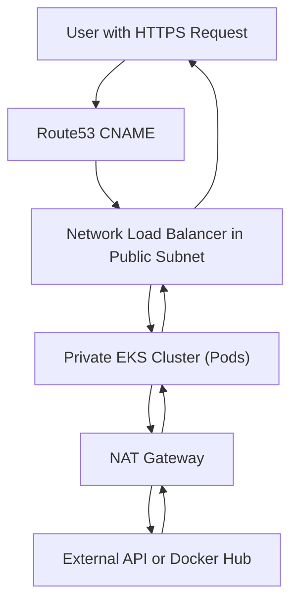
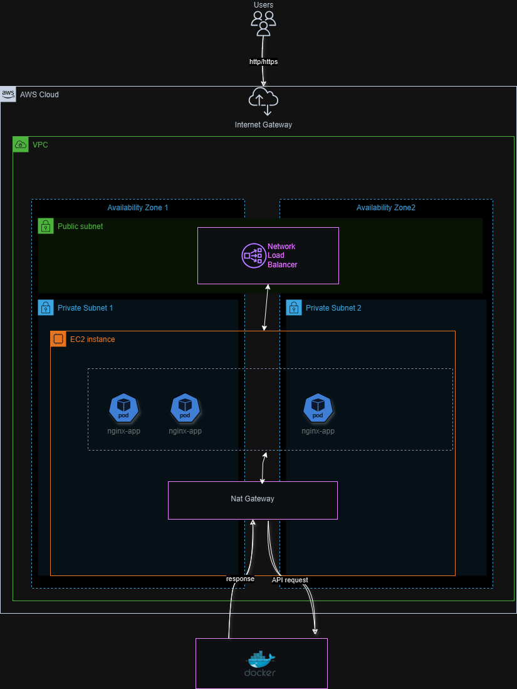

# DevOps Workshop

Welcome to the DevOps Workshop! This repository contains essential configuration files and resources for deploying and managing modern cloud infrastructure and containerized applications. This project was developed as part of a comprehensive course provided by Wix, under the mentorship of the senior DevOps team.

---

## Repository Structure

### Terraform Configuration Files

1. **`config.tf`**

   - Specifies backend and provider configurations for Terraform.

2. **`locals.tf`**

   - Defines reusable local values for consistent references throughout Terraform files.

3. **`main.tf`**

   - Main Terraform configuration file defining core infrastructure components, including:
     - Subnets
     - Route Table
     - S3 Bucket Policy
     - EKS Cluster
     - Route53 CNAME Record

4. **`provider.tf`**

   - Configures the cloud provider (AWS, in my case) to provision and manage infrastructure resources.


5. **`variable.tf`**

   - Contains variable definitions to allow dynamic configuration of Terraform resources.

---

### Kubernetes Deployment Files

1. **`nginx-deployment.yaml`**

   - Defines the Kubernetes deployment for an Nginx test application.
   - Specifies the desired number of replicas, container image, and other deployment parameters.

2. **`nginx-service.yaml`**

   - Configures a Kubernetes service to expose the Nginx application.
   - Defines the service type (LoadBalancer) and target ports.

---

### Helm Configuration

1. **`values.yaml`**
   - Provides configurable parameters for a Helm chart deployment.
   - Note: This project does not use a Helm chart as part of the infrastructure. However, `values.yaml` is included as Helm was covered in the course and is relevant for future use.

---

## Getting Started

### Prerequisites

To get started, ensure you have the following tools installed and configured:

- [Terraform](https://www.terraform.io/downloads.html)
- [kubectl](https://kubernetes.io/docs/tasks/tools/)
- [helm](https://helm.sh/docs/intro/install/) (For future use)
- Access to a Kubernetes cluster
- Proper credentials for your cloud provider (AWS, in my case)

---

### Setting Up Infrastructure

Follow these steps to provision infrastructure:

1. **Initialize Terraform:**

   ```bash
   terraform init
   ```

2. **Plan the infrastructure changes:**

   ```bash
   terraform plan
   ```

3. **Apply the infrastructure changes:**

   ```bash
   terraform apply
   ```

---

### Deploying to Kubernetes

Once the infrastructure is provisioned, deploy your Kubernetes resources:

1. **Apply the Nginx deployment:**

   ```bash
   kubectl apply -f nginx-deployment.yaml
   ```

2. **Apply the Nginx service:**

   ```bash
   kubectl apply -f nginx-service.yaml
   ```

3. **Verify the deployment:**

   ```bash
   kubectl get deployments
   kubectl get services
   ```

---

### Using Helm (For Future Use)

1. Deploy a Helm chart with custom values:

   ```bash
   helm install my-release -f values.yaml <chart-name>
   ```

2. Verify the Helm release:

   ```bash
   helm list
   ```

---

## Infrastructure Resource Flow Diagram

Below is a detailed resource flow diagram created using Mermaid. It illustrates how user requests are processed through Route53, Load Balancer, EKS Cluster, and other resources:



---


## Infrastructure and Network Architecture


Below is a high-level architecture diagram created with draw.io. It includes details about VPCs, subnets, and how components like the Load Balancer, EKS Cluster, and NAT Gateway are connected:




---

## Notes

- Ensure your Kubernetes context is properly set before applying any configurations.
- Review and customize the `values.yaml` file for specific deployment requirements.
- Validate your Terraform code before applying it to prevent misconfigurations.

---

## Support

If you encounter any issues or have questions, feel free to reach out .

---

## License

This project is licensed under the MIT License.